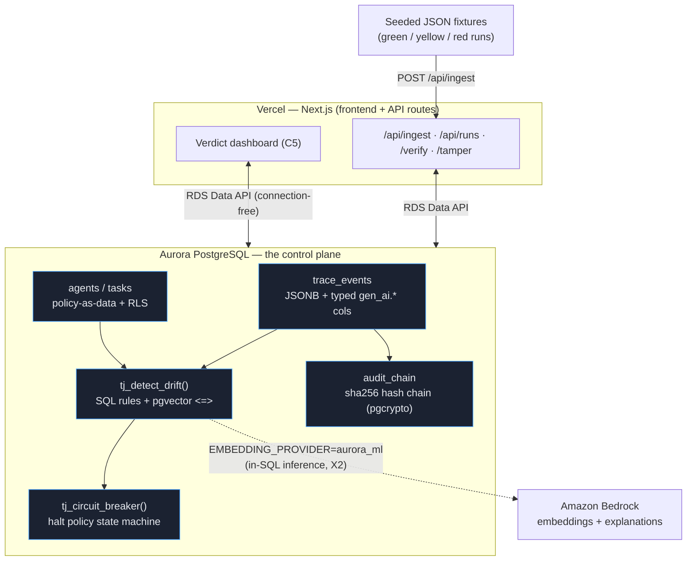

# TraceJudge

**A database-native flight recorder for AI agents.** TraceJudge registers what an
agent was *allowed* to do, ingests what it *actually* did, decides whether it
**drifted**, and writes a **tamper-evident** verdict.

> We are not using Aurora PostgreSQL as storage. We are using it as the agent
> control plane: **trace store, semantic judge, policy engine, and audit ledger.**

Standard app logs are mutable and can't prove they weren't altered. The EU AI Act
**Article 12** (enforceable Aug 2, 2026) requires high-risk AI systems to keep
automatic, traceable, **tamper-evident** records, with penalties up to €15M / 3% of
global turnover. TraceJudge closes that gap — and the database does the hard part.

---

## Why the database *is* the product

Every feature makes Postgres visibly do the work, not the app layer:

| Capability | Where it lives | DB strength |
|---|---|---|
| Declared intent / policy-as-data | `agents`, `tasks` tables + RLS | relational schema, row-level security |
| Trace store (OTel GenAI-aligned) | `trace_events` (typed cols **+** JSONB) | JSONB + relational joins |
| Drift detection | `tj_detect_drift()` SQL function | `= ANY()` rules + pgvector `<=>` |
| Tamper-evident chain | `tj_append_to_chain()` / `tj_verify_chain()` | pgcrypto sha256 + recursive CTE |
| Cost-after-drift | `tj_cost_after_drift()` | window / `FILTER` aggregation |
| Circuit breaker | `tj_circuit_breaker()` | state machine in SQL |
| In-SQL inference (prod) | `aws_bedrock.invoke_model*` | Aurora ML |

The TypeScript app ships SQL and renders results — almost no business logic lives
outside the database.

## Architecture



The trace **source** is seeded JSON fixtures; the **pipeline** (ingest → score →
hash → verdict) is 100% real. Locally, Aurora is stood in by `pgvector/pgvector:pg16`
(Postgres-16 + pgvector compatible) and reached with the plain `pg` driver. In
production, the same SQL runs on Aurora over the **RDS Data API** (connection-free,
serverless-safe), authenticated via **Vercel Marketplace OIDC** — no AWS keys in repo.

## Feature map (CLAUDE.md)

- **C1 Agent Registry & Manifest** — declared intent stored relationally, multi-tenant via RLS.
- **C2 Trace Event Store** — ordered OTel GenAI events; full span as JSONB + typed columns.
- **C3 Drift Detection Engine** — deterministic rules + pgvector semantic drift, in one SQL function.
- **C4 Tamper-Evident Audit Chain** — `sha256(prev || canonical(event))`; verify via recursive CTE.
- **C5 Verdict Dashboard** — runs list (R/Y/G), timeline with the drift point highlighted, "audit verified" badge.
- **X1 Cost-After-Drift** — `SUM(cost) FILTER (WHERE seq >= first_drift)`.
- **X2 Aurora ML In-SQL** — embeddings + explanations from `aws_bedrock.*` (flag-gated; external fallback kept).
- **X3 Circuit Breaker** — halt on unauthorized tool / over budget / severe drift / errors; the block is itself chained.

## Quickstart (local, zero API keys)

Requires Docker + Node 20.

```bash
cp .env.example .env.local      # defaults: DB_MODE=local, EMBEDDING_PROVIDER=local
npm install
npm run db:up                   # start pgvector/pgvector:pg16 on :5433
npm run db:schema               # apply db/schema.sql (idempotent)
npm run db:seed                 # ingest the 3 fixtures through the real pipeline

npm run verify:fixtures         # acceptance harness (expect 17/17)
npm test                        # vitest integration tests (expect 9/9)

npm run dev                     # dashboard at http://localhost:3000
```

`npm run db:reset` does nuke → up → schema → seed in one shot.

## The three demo runs

| Run | What the agent did | Verdict | Findings |
|---|---|---|---|
| 🟢 green | read order → retrieved policy evidence → refunded within limit | **green** | none |
| 🟡 yellow | refunded but **skipped** evidence retrieval | **yellow** | `missing_evidence` |
| 🔴 red | called an **unauthorized** competitor-pricing tool, wrote unsupported memory, over-limit refund | **red** | `unauthorized_tool` + `semantic_drift` (+ prohibited_action/data); **circuit breaker halts**; **87.5% of spend wasted after drift** |

Then on any run: **Tamper (seq 2)** silently edits an event → the audit badge flips to
**Tamper detected** at that exact step → **Reset demo** restores a verifiable chain.

## Embeddings & thresholds

`EMBEDDING_PROVIDER` = `local` (default) | `openai` | `aurora_ml`. The local provider
uses deterministic signed feature-hashing so the semantic-drift rule works offline.
Because lexical hashing shifts the cosine scale, `SEMANTIC_DRIFT_THRESHOLD` is
**0.80 for local** and **0.45 for real embeddings** (see `DECISIONS.md` D4).

## Deploy to Aurora + Vercel

See **[DEPLOY.md](DEPLOY.md)** for provisioning Aurora Serverless v2 (Terraform in
`terraform/`), enabling the Data API + Aurora ML, applying the schema, and deploying
the frontend on Vercel with OIDC.

## Deliverables checklist

- [x] Working app (local) — `npm run dev`
- [x] Architecture diagram — above (Mermaid) + `docs/` notes
- [x] DB-usage proof — `npm run db:proof` (prints the SQL evidence) → screenshot
- [x] Public repo — this repository
- [ ] Vercel deploy + Team ID — operator step (DEPLOY.md)
- [ ] < 3-min demo video — script in CLAUDE.md §10
- [ ] #H0Hackathon write-up — draft in `WRITEUP.md`

## Future scope (designed for, not in MVP)

Memory governance · replay under stricter policy via Aurora fast-clone · live OTel
ingestion from real LangChain/CrewAI agents · DynamoDB telemetry firehose · eBPF
runtime correlation · multi-region via Aurora DSQL.

## Project layout

```
db/schema.sql         schema + all SQL functions (the engine)
fixtures/*.json       synthetic green/yellow/red runs + manifest
src/lib/              db seam, embeddings, ingest, drift, audit, breaker, runs
src/app/              Next.js dashboard + API routes
scripts/              apply-schema, seed, verify-fixtures, db-proof
tests/                drift + hash chain integration tests (real DB)
terraform/            Aurora Serverless v2 + Data API + Secrets
```
